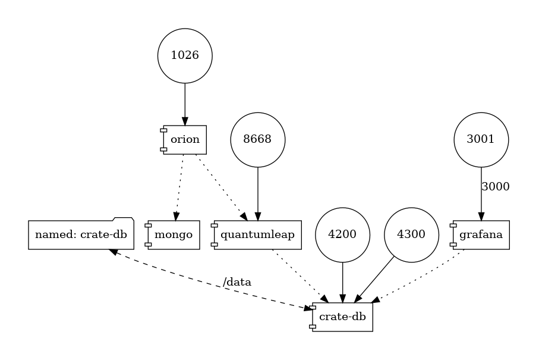

# THMHO_ocb - Orion Context Broker
This repository contains the dockerized `orion context broker` along with the QuantumLeap for storing the time series data.
## Starting up ocb
Launch the Orion Context Broker(OCB) in the docker container with port `1026` exposed.
```
docker-compose up
```
# Architecture


References
  - [Use OCB with docker](https://fiware-orion.readthedocs.io/en/1.3.0/user/docker/index.html)
  - [Database administration](https://fiware-orion.readthedocs.io/en/master/admin/database_admin/index.html)
  - [Time series data - FIWARE](https://github.com/FIWARE/tutorials.Time-Series-Data/tree/NGSI-LD)
